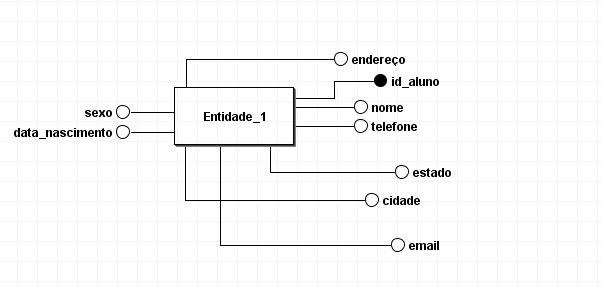
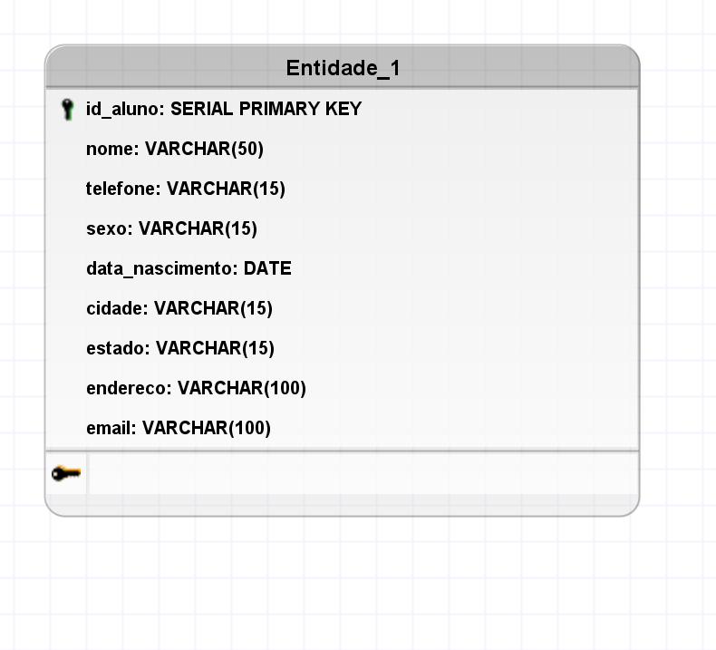
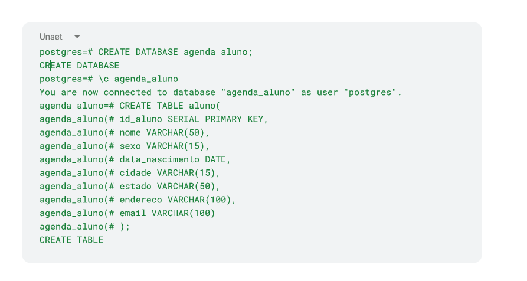
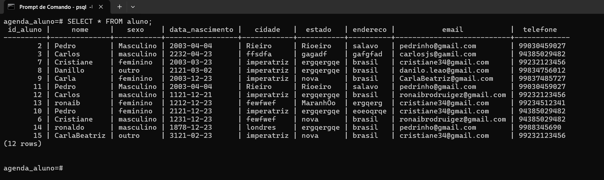

# Documentação do Projeto de Banco de Dados

## Dependências 

O projeto utiliza as seguintes dependências do Node.js, instaladas a partir do npm.

1. **Fastify**: Um frameworkk web extremamente leve para o Node.js que permite a construção de aplicações web e APIs de forma rápida e eficiente
- **Instalação**:  `npm install fastify`

2. **pg**: Um cliente PostgreSQL para Node.js, permitindo a conexão e a execução de consultas em banco de dados PostgreSQL
- **Instalação**: `npm install pg`

3. **cors**: Um pacote que permite que seu servidor aceita requisições de diferentes domínios.
- **Instalação**: `npm install cors`

4. **dotenv**: Um módulo que carrega variáveis de ambiente a partir de um arquivo `.env` para `process.env`, ajudando a gerenciar as configurações sensíveis.
- **Instalação**: `npm install dotenv`

# Estrutura da tabela do banco de dados

## Modelo Conceitual 
O modelo conceitual é uma visão abstrata do banco de dados, focado em entender quais são os dados necessários e como eles se relacionam entre si. 

## Modelo Lógico 
O modelo lógico detalha mais o design do banco de dados, ainda de maneira independente de um Sistema de Gerenciamento de Banco de Dados (SGBD) específico. Ele começa a adicionar estruturas como chaves primárias e chaves estrangeiras e define o tipo de dado de cada atributo.

## Modelo Físico
O modelo físico é uma representação detalhada de como o banco de dados será implementado em um SGBD específico. Ele define como as tabelas e dados serão armazenados, organizados e acessados no sistema de armazenamento. No projeto, utilizamos postgreSQL para a implementção do banco de dados.

### Tabela Aluno 

